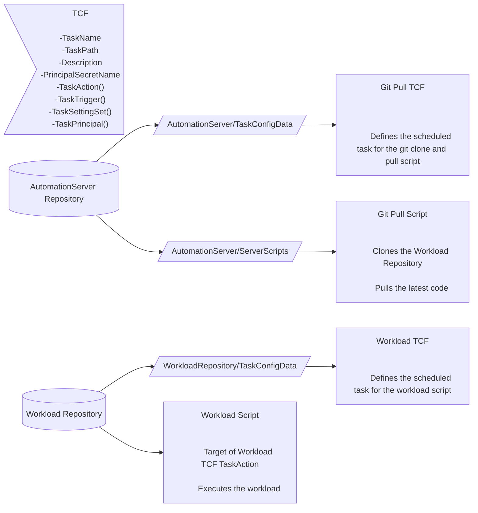
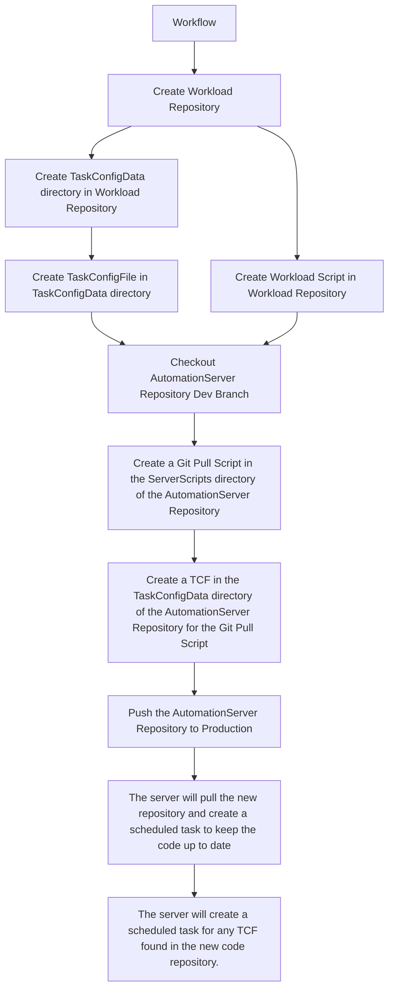

# What Files Go Where?

## File Layout

```mermaid
flowchart LR
    TCF>"TCF

-TaskName
-TaskPath
-Description
-PrincipalSecretName
-TaskAction()
-TaskTrigger()
-TaskSettingSet()
-TaskPrincipal()
    "]
    
    DERepo[(AutomationServer Repository)]          --> DETCD[/AutomationServer/TaskConfigData/]
    DERepo                                      --> DESS[/AutomationServer/ServerScripts/]
    
    WorkRepo[(Workload Repository)]             --> WorkTCD[/WorkloadRepository/TaskConfigData/]
    WorkRepo                                    --> WorkloadScript["Workload Script

                                                    Target of Workload TCF TaskAction
                                                    Executes the workload"]
    WorkTCD                                     --> WorkloadTCF["Workload TCF

                                                    Defines the scheduled task for the workload script"]
    DESS                                        --> GitPullScript["Git Pull Script

                                                    Clones the Workload Repository
                                                    Pulls the latest code"]
    DETCD                                       --> GitPullTCF["Git Pull TCF
                                                    
                                                    Defines the scheduled task for the git clone and pull script"]
```

## Workflow

```mermaid
flowchart TD
    WorkFlow[Workflow]                          --> CreateRepo["Create Workload Repository"]
    CreateRepo                                  --> CreateTCD["Create TaskConfigData directory in Workload Repository"]
    CreateTCD                                   --> CreateTCF["Create TaskConfigFile in TaskConfigData directory"]
    CreateRepo                                  --> CreateScript["Create Workload Script in Workload Repository"]
    CreateTCF                                   --> UpdateDEAutomationRepo["Checkout AutomationServer Repository Dev Branch"] 
    CreateScript                                --> UpdateDEAutomationRepo
    UpdateDEAutomationRepo                      --> CreateDEAutomationGitPull["Create a Git Pull Script in the ServerScripts directory of the AutomationServer Repository"]
    CreateDEAutomationGitPull                   --> CreateDEAutomationTCF["Create a TCF in the TaskConfigData directory of the AutomationServer Repository for the Git Pull Script"]
    CreateDEAutomationTCF                       --> PushToProduction["Push the AutomationServer Repository to Production"]
    PushToProduction                            --> ServerPull["The server will pull the new repository and create a scheduled task to keep the code up to date"]
    ServerPull                                  --> IngestWorkload["The server will create a scheduled task for any TCF found in the new code repository."]
    
```
