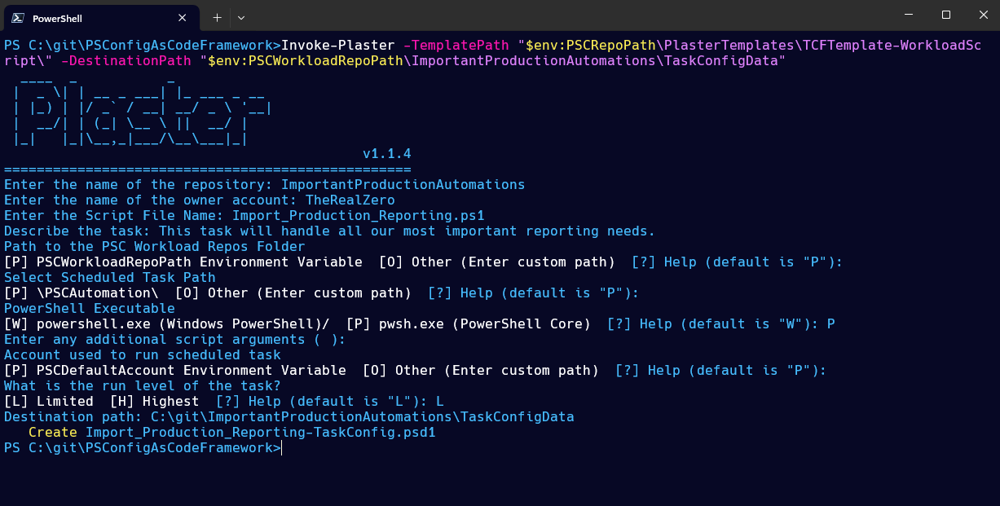

# PowerShell Configuration-As-Code Framework

PSConfigAsCodeFramework is a toolset for managing PowerShell automation scripts using scheduled tasks in windows.

It consists of four components:

- Task Configuration File Schema

    - A Task Configuration File (TCF) is a PowerShell Data File (.psd1) that describes a scheduled task.
    - The automation frame work can read these files and create scheduled tasks as described in the file.


- The PSCServer Module
    
    - This is a set of functions your automation server will use to read TCFs then Create, Update and Disable scheduled tasks.
    - It can also help you create environment variables on your automation server.

- Plaster Templates
    - These are templates for creating new TCFs and Git Pull scripts.

- Environment Variables
    - By defining environment variables for the default log directory, the directory that contains your cloned git repositories, GitHub user name and more, you can make your automation scripts more flexible, portable and maintainable.


# Getting Started
## Prerequisites
- PowerShell 5.1 or later
- Windows 10 or later, or Windows Server 2016 or later
- Git for Windows
- Plaster module (for creating new TCFs and Git Pull scripts)


## Installation
1. Clone the repository:
```powershell
   git clone https://github.com/TheRealZero/PSConfigAsCodeFramework.git
```
2. Navigate to the cloned directory:
```powershell
    cd PSConfigAsCodeFramework
```
3. Import the PSCServer module:
```powershell
    Import-Module .\PSCServer.psm1
```
4. Optionally, set up environment variables for your automation server:
```powershell
    $params = @{
        PSCDefaultAccount = "PSCAutomation"
        PSCRepoPath = "C:\git\PSConfigAsCodeFramework"
        PSCWorkloadRepoPath = "C:\git\Workloads"
        PSCDefaultOwner = "DefaultOwner"
        PSCLogOutputPath = "C:\Logs"
    }

    New-PSCEnvironmentVariables @params
```

## Usage
### Creating a new Workload Task Configuration File (TCF)
Once you have created an automation script in a separate repository, you can create a Task Configuration File (TCF) to describe the scheduled task that will run your script.
In the PSConfigAsCodeFramework these repositories are referred to as "Workload Repositories" and the automation scripts as "Workload Scripts" because I made this all up and I can call it whatever I want. (:
You can use the Plaster module to create a new TCF based on a template. The following command will create a new TCF for a Workload Script TCF:

```powershell
    Invoke-Plaster -TemplatePath "$env:PSCRepoPath\PlasterTemplates\TCFTemplate-WorkloadScript\" -DestinationPath "$env:PSCWorkloadRepoPath\TaskConfigData"
```



This will invoke the Plaster template to create a new TCF in the specified destination path.  The TCF will be created in the `TaskConfigData` directory of your workload repository.
Note: TCFs should always be created in the `TaskConfigData` directory of your workload repository.  This is where the automation framework will look for TCFs to create scheduled tasks.

### Create a new GitPull Script
To create a new GitPull script, which is a PowerShell script that will pull the latest changes from a Git repository, you can use the following command:

```powershell
    Invoke-Plaster -TemplatePath "$env:PSCRepoPath\PlasterTemplates\GitPullScript\" -DestinationPath "$env:PSCRepoPath\ServerScripts"
```


This command will invoke the Plaster template to create a new GitPull script in the specified destination path. The script will be created in the `ServerScripts` directory of your PSC repository.  It will also create a Task Configuration File (TCF) in the `TaskConfigData` directory of your PSC repository.


## Bringing it all together
So far we have:
- Created a new Workload Task Configuration File (TCF) for a Workload Script.
- Created a new GitPull script that will pull the latest changes from the repository where the Workload stored is stored.
- Created a Task Configuration File (TCF) for the GitPull script.

Now we can use the PSCServer module to create a scheduled task that will run the GitPull script and update the Workload TCFs.

```powershell
    New-PSCServerScheduledTask -ConfigFilePath "C:\Git\PSConfigAsCodeFramework\ServerScripts\TaskConfigData\GitPull-TaskConfig-TheRealZero-ImportantProductionAutomations.psd1"
```

This command will create a scheduled task that will run the GitPull script and keep the latest code from that repository on the automation server.

## Do it again, but more automatey

There is a script that will automate the process of ingesting the TCFs and creating/updating the scheduled tasks on the automation server.  This script will read all TCFs in the `TaskConfigData` directory of your PSC repository and all your workload repositories, then create or update the scheduled tasks on the automation server.

```powershell
    $env:PSCRepoPath\ServerScripts\CreateEditOrDisableTasksFromConfigs.ps1
```

## Updating your workload scripts

When you update your workload scripts, the changes you push to your workload repository will not automatically be pulled to the automation server.  If you've created a scheduled task for CreateEditOrDisableTasksFromConfigs it will ingest the latest TCFs and create or update the scheduled tasks on the automation server.

